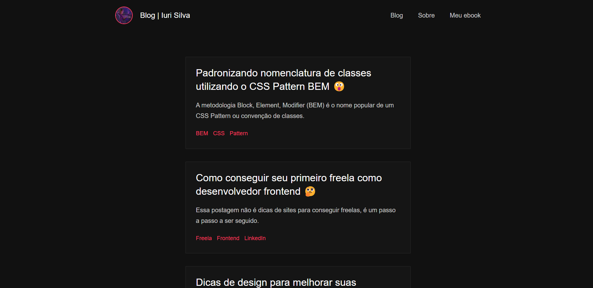

<h1 align="center">
  ☕ Blog - Edson Costa
</h1>

<h4 align="center"><a href="https://edsoncosta.online/">Clique para visitar o projeto</a></h4>

---

## 💼 Tecnologias utilizadas

Para o desenvolvimento deste site utilizei as seguintes tecnologias:

- Next.js
- TypeScript
- CSS Module

---

<h2>🦄 Autor</h2>

<table>
  <tr>
    <td align="center">
      <a href="https://github.com/ecsistem">
         
        
          <b>Edson Costa</b>
        
      </a>
    </td>
  </tr>
</table>
